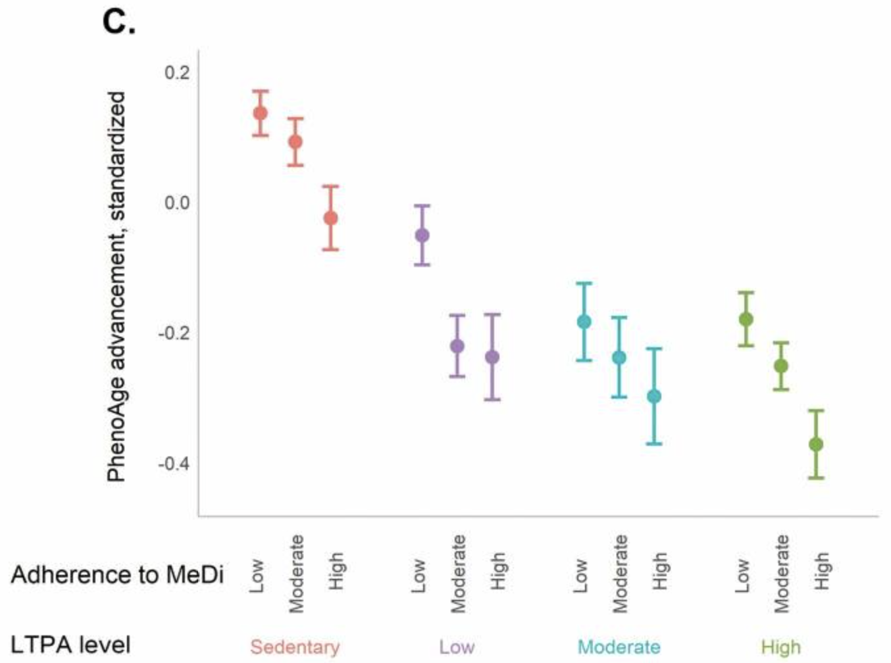

# AI Assisted Coding Worked-Through Example {.unnumbered}

<small>Updated: March 26<sup>th</sup>, 2026</small>

## The Art of Shrewd AI-Assisted Programming

A common academic use case for AI-assisted coding is replicating published research. Some papers come with ready-to-run code that's easy to pick up, while others leave you hunting for clues without any code at all. A complete A-Z replication would take more time than we have in this workshop, but the provided example shows how <span class="text-term" data-hover-text="The use of AI tools to support software development tasks, such as generating, completing, explaining, or debugging code based on natural language prompts or existing code context. Reliance on AI for coding support exists on a spectrum, ranging from no use to full, unsupervised dependence." data-popup-width="320px">
  AI-assisted coding
</span>can help you expedite your replication process.

Undoubtedly, integrating AI into your workflows can quicken your process, but it also has the potential to create new headaches or amplify problems that arise when quality checks are skipped. As a data scientist or analyst, it's essential to always scrutinize your data processing and cleaning methods to ensure accurate data preparation. For example, check that nomenclature is informative and consistent, confirm that NAs aren't standing in for zeros (or vice versa), and verify that subsetting, grouping, or processing are performed in the right order to produce your expected outcome.

An AI is not going to be much help for you in this area—at least not reliably. You cannot expect it to completely or correctly identify all the data wrangling needed for a dataset, especially if your starting raw data is messy! Be especially careful when it suggests code that runs perfectly but doesn't actually do what you need. It may even produce results that kind of look right, but after further quality checking, you might discover it missed or miscalculated something important.

```{=html}
<figure style="float: center; position: relative; margin-top: 0.5em; margin-bottom: 0.5em;">
  
  
  <figcaption style="text-align: left; margin-bottom: 1.5em;">
    The Generative Engineering automation spectrum by <a href="https://www.bcg.com/x/the-multiplier/ai-assisted-coding-generative-engineering">Max Struever, Matthew Kropp, and Julie Bedard</a>. Accessed March 21<sup>st</sup>, 2026.
  </figcaption>
</figure>
```

The shrewd AI-assisted coder knows how to leverage AI's strengths while catching its inevitable mistakes; remeber you are the brains of the operation, not the AI. Whether you're coding with AI assistance or doing it alone, always take time to thoroughly review your data, prepare it into a complete tidy format, and run quality checks to verify your assumptions and calculations. Your goal is to stay within the L1–L3 AI reliance range and avoid over-relying on <span class="text-term" data-hover-text="An approach to software development where developers use natural language to describe what they want, and AI handles the technical implementation — requiring little to no coding knowledge. While fast, it risks errors, security issues, and unreliable software, and is not recommended when the goal is a working, production-ready product." data-popup-width="320px">
  vibe coding
</span>\ [@anthropic_study; @ai_assistance_scale; @best_practices].

If you would like guidance on how to best prepare your data into a complete tidy format, review concepts of data wrangling, tidy data structures, and best practices for data inclusion and exclusion in our ["Introduction to Programming in R and Data Wrangling with `tidyverse`"](../../Intro-to-Programming-in-R/Pages/programming-r-worked-through-example.html) workshop.

## Paper in Focus: Study Context, Data Description, and Replication Plan

::: img-float
{style="float: left; position: relative; top: 0px; padding-right: 30px; margin-top: -1.7em !important; margin: -1em auto -1.5em auto;" width="350"}
:::

In this example, we aim to reproduce selected summary statistics and figures from Thomas et al. (2023), [“Healthy Lifestyle Behaviors and Biological Aging in the U.S. National Health and Nutrition Examination Surveys, 1999–2018”](https://pmc.ncbi.nlm.nih.gov/articles/PMC10460553/)\ [@thomas2023]. Specifically, we want to recreate plots like the one shown on the left, which depicts the associations of Mediterranean diet adherence and physical activity with PhenoAge advancement.

Thomas et al. investigated whether healthier lifestyle behaviors are associated with more favorable epigenetic markers of aging, drawing on the prevailing concensus that diet quality and physical activity are linked to reduced chronic disease risk and increased longevity. Aging is accompanied by measurable molecular changes, including increases in DNA methylation (DNAm), increased inflammation, and diminished cellular stress- and damage-response capacity\ [@maslov2009; @rutledge2022]. Rather than implementing a prospective longitudinal design, the authors adopted a cross-sectional strategy that estimates biological age via a machine-learning model trained to predict individuals’ biological age from epigenetic biomarkers measured at the time of assessment.

We do not attempt to evaluate the validity of the study’s design choices. For instance, it is not obvious that a single 24-hour dietary recall collected during an NHANES visit provides a reliable proxy for long-run dietary patterns. Consequentially, biomarker measurements taken at a single time point—without information on participants’ cumulative history of diet and physical activity—could plausibly bias estimated associations. Instead, our focus is narrower: we examine whether the age-stratified panels in Figure 3 might be influenced by compositional differences across age groups, such as uneven distributions of sex or BMI.

### Data Source Considerations

This paper used the Continuous [National Health and Nutrition Examination Survey (NHANES)](https://www.cdc.gov/nchs/nhanes/index.html) dataset, which provides information on participants' eating and exercise habits, anthropometric measurements, and lab results\ [@nhanes_home]. The continuous series was launched in 1999 and has been conducted biennially since then. NHANES is a cross-sectional study that uses a stratified, multistage, probability-clustered sample of approximately 5,000 participants from 15 counties and includes sampling weights to generate nationally representative estimates\ [@nhanes_analyses_datasets; @nhanes_analyses_guides; @thomas2023]. The authors applied the PhenoAge algorithm to predict participants' biological age using the "Levine Original" formula (9 biomarkers) from the `BioAge` R package, which was trained on NHANES-III data (collected 1988–94): package [paper](https://link.springer.com/article/10.1007/s11357-021-00480-5) and [documentation](https://github.com/dayoonkwon/BioAge)\ [@kwon2021; @bioage_github; @levine2018].

:::{.callout-tip collapse="true"}
## Other DSDE Data Resources

Our team puts together other resources for the Yale community and public health and epidemiological researchers at large. If you would like to learn more about NHANES and how to access the data, please review our webpage about this resource: [Resource Navigation Tool - NHANES](https://ysph-dsde.github.io/resources-page/Pages/More-Info-Pages/Freely-Accessible/NCHS%20NHANES.html).
:::

Based on the methods section, the paper implies the use of sample weights to generate national estimates. Weight selection varies depending on which data files you're combining, and weighted datasets require survey-specific functions for analysis (e.g., `svyglm` instead of `glm`)\ [@nhanes_analyses_weighting; @ucla_survey; @kyle_suvey]. However, the `BioAge` R package doesn't appear to use weighted NHANES-III data when training the PhenoAge model. For consistency and simplicity, we'll skip the weights in this example and focus on participant-level results instead.

:::{.callout-warning}
Minimal differences in sample size were observed between our pipeline and the paper up until the pre-calculated PhenoAge values were assessed. At that step, approximately 10,000 more participants were identified as having missing PhenoAge values than reported in the paper.
:::

### Data Dictionary

Understanding what each variable represents and its associated method specifics is essential. This publication draws on seven NHANES datasets that were combined to compile the data:

- Demographic Variables & Sample Weights (DEMO) ([codebook](https://wwwn.cdc.gov/nchs/data/nhanes/public/1999/datafiles/DEMO.htm#DMDMARTL))\ [@codebook_demo]
- Dietary Interview - Individual Foods, First Day (DR1IFF_L) ([codebook](https://wwwn.cdc.gov/Nchs/Data/Nhanes/Public/2021/DataFiles/DR1IFF_L.htm#DR1IKCAL))\ [@codebook_diet_day1]
- Dietary Interview - Individual Foods, Second Day (DR2IFF_L) ([codebook](https://wwwn.cdc.gov/Nchs/Data/Nhanes/Public/2021/DataFiles/DR2IFF_L.htm))\ [@codebook_diet_day2]
- Physical Activity - Individual Activities (PAQIAF) for 1999 to 2005 ([codebook](https://wwwn.cdc.gov/Nchs/Data/Nhanes/Public/1999/DataFiles/PAQIAF.htm#PADTIMES))\ [@codebook_paqiaf_1999to05]
- Physical Activity (PAQ_E) for 2007 and onward ([codebook](https://wwwn.cdc.gov/Nchs/Data/Nhanes/Public/2007/DataFiles/PAQ_E.htm#PAD615))\ [@codebook_paq_2007plus]
- Smoking - Cigarette/Tobacco Use - Adult (SMQ) ([codebook](https://wwwn.cdc.gov/nchs/data/nhanes/public/1999/datafiles/SMQ.htm))\ [@codebook_smoking]
- Body Measures (BMX) ([codebook](https://wwwn.cdc.gov/nchs/data/nhanes/public/1999/datafiles/BMX.htm))\ [@codebook_bmx]

Data were accessed through the nhanesdata R package, which maintains a stable cloud storage of Continuous NHANES biennial datasets harmonized across cycles: [package webpage](https://www.kylegrealis.com/nhanesdata/index.html) and [documentation](https://github.com/kyleGrealis/nhanesdata)\ [@nhanesdata; @nhanesdata_github]. The majority of data curation and processing has been handled prior to this example; the prepared dataset variables and details are listed below. The two dietary datasets are the only exception and will be processed here, with further details provided in that section. Additionally, pre-calculated PhenoAge projections estimated using NHANES-III have been merged into the Continuous NHANES data.

Pre-processed dataset variables:

:::: {.columns}

::: {.column width="50%"}
- **seqn:** Respondent sequence number
- **year:** Year the participant was recorded
- **sddsrvyr:** Continuous NHANES biennial survey cycle
- **ridageyr:** Adjudicated age at screening in years
- **riagendr:** Gender
- **ridreth1:** Reported race and ethnicity
- **dmdeduc2:** Education level for Adults 20+
- **dmdmartl:** Marital status
- **indfmpir:** Family poverty income ratio (PIR) - a ratio of family income to poverty threshold
- **ridexprg:** Pregnancy status at exam
- **smoking_status:** Current smoking behavior and history
- **bmi_category:** Body mass index (BMI) categorized as: Normal, Overweight, or Obese
- **MET:** Metabolic equivalent of task (MET) - calculated from moderate and vigorous physical activity tracking
:::

::: {.column width="50%"}
- **activity_level:** Classification of the MET score
- **avg_kcal:** Total calories consumed during the 24-hour recall, averaged over two interview days
- **sd_kcal:** Standard deviation associated with the two interview days
- **MeDi:** Scale of Mediterranean diet adherence
- **phenoage_original:** "Levine Original" formula using 9 biomarkers\ [@levine2018; @kwon2021]
- **phenoage_modified:** "Modified Levine" formula using 12 biomarkers\ [@levine2018; @kwon2021]
- **advancement_original:** "Levine Original" PhenoAge - Chronological Age
- **advancement_modified:** "Modified Levine" PhenoAge - Chronological Age
- **advancement_original_std:** Standardized advancement using "Levine Original" PhenoAge (mean = 0, sd = 1)
- **advancement_modified_std:** Standardized advancement using "Modified Levine" PhenoAge (mean = 0, sd = 1)
:::

::::

:::{.callout-note collapse="true"}
## Raw Data and Preparation

Much of the data preparation has been conducted in the background so this example can remain focused on AI-assisted coding techniques. If you want to review the complete data processing steps, along with links to the full data dictionary associated with the NHANES datasets used, see ["Code/Data Cleaning/Import and Compiling Continuous NHANES 1999 to 2018.R"](https://github.com/ysph-dsde/Book-of-Workshops/tree/main/Workshops/Code-Smarter-Not-Harder/Code/Data%20Cleaning/).
:::

## Put It Into Practice

```{r setup}
#| message: FALSE
#| warning: FALSE
#| output: FALSE
#| echo: false

## renv() will install all of the packages and their correct version used here.
#renv::init()
renv::restore()

## Load in the R packages used in this script from the project library.
suppressPackageStartupMessages({
  library("nhanesdata") # Access compiled NHANES data
  library("readr")      # For reading in the data
  library("tidyr")      # For tidying data 
  library("dplyr")      # For data manipulation
  library("stringr")    # For string manipulation
  library("ggplot2")    # For creating static visualizations
  library("gridExtra")  # Format multiple plots together
})


## This function will check if an element is not in a vector.
"%!in%" <- function(x,y)!('%in%'(x,y))

```


The following three exercises walk you through a pre-prepared guided analysis aimed at replicating figures from Thomas et al. If you have not already done so, download the pre-prepared codespace and configure your device with Positron and a coding assistant provider: [Accessing the Codespace](../ai-coding-index.html#accessing-the-codespaces). As some steps can be complex, rather than developing the analysis independently, we encourage you to explore how different foundational models and AI agents respond to your prompts.

As you go through each exercise, keep these approaches in mind:

i. Move from broad to specific prompts, starting with something like "Generate `ggplot2` code that will plot this screenshot of a figure from a paper" to something like "Plot `df` with `x = activity_MeDi`, `y = mean_adv`, and `color = activity_level`. Facet wrap over `age_group` and relabel the x-axis with `rep(c("Low", "Moderate", "High"), times = 4)`."

ii. Solve the same problem using [Yale's AI Clarity](https://ai.yale.edu/yales-ai-tools-and-resources/clarity-platform) chatbot and GitHub Copilot in Positron, then compare the results

iii. Test different foundational models (i.e. GPT, Claude, Gemini) to see how each performs

Take a moment to ask yourself or discuss with your neighbor:


:::: {.columns}

::: {.column width="50%"}
- Were the prompts effective across both Yale's AI Clarity and the Positron Assistant, or did they need adjustment between tools?
- Which tool required more context to produce useful responses?
- At what point did your prompts become too vague for the Positron Assistant?
- Did different models tend to respond similarly, or were there meaningful differences?
:::

::: {.column width="50%"}
- How much back-and-forth and refactoring was typically needed to fully resolve a problem?
- How often did you need to intervene on something the AI could not handle?
- When asking the AI to explain code or guide analysis, how relevant and accurate were its responses?
- How often did you feel unequipped to evaluate whether a response was correct?


:::

::::

### Mediterranean Diet Scoring

Our paper scored adherence to the Mediterranean Diet using the method developed by Trichopoulou et al. (1995 and 2003)\ [@trichopoulou2003; @trichopoulou1995]. To calculate each participant's score, individual 24-hour food recall records were used. Thomas et al. averaged across both assessment days, though in many cases only the first day was available\ [@nhanes_analyses_dietary; @thomas2023]. Food types were classified by NHANES using the USDA's Food and Nutrient Database for Dietary Studies (FNDDS) encoding: [Appendix B](https://www.ars.usda.gov/ARSUserFiles/80400530/pdf/fndds/fndds_doc.pdf) and [Appendix H](https://www.ars.usda.gov/ARSUserFiles/80400530/pdf/fndds/2021_2023_FNDDS_Doc.pdf)\ [@fndds_table1; @fndds_table2].

The FNDDS encodings are already included and have been translated for Mediterranean Diet scoring according to Trichopoulou et al.

```{r}
#| message: FALSE
#| warning: FALSE

# Load the Mediterranean diet food group reference data
mediterranean_groups <- read_csv(file = "https://raw.githubusercontent.com/ysph-dsde/Book-of-Workshops/refs/heads/main/Workshops/Code-Smarter-Not-Harder/Data/Mediterranean%20Diet%20Food%20Groups_Trichopoulou%20et%20al%202003.csv", show_col_types = FALSE,
                                 col_types = cols(code = col_character()))

glimpse(mediterranean_groups)
```

To replicate the paper's methods, process the data as follows to calculate the "MeDi" score:

1) For beneficial foods (vegetables, potatoes, fruits, legumes and nuts, fish, cereals), participants receive +1 point if their caloric intake meets or exceeds the median.

2) For detrimental foods (meat, poultry, dairy products), participants receive +1 point if their caloric intake is below the median.

3) For alcohol, +1 point is awarded for mild-to-moderate consumption (0–1 drink per day for females; 0–2 drinks per day for males). The  National Institute on Alcohol Abuse and Alcoholism (NIAAA) defines one standard drink as 14 grams of pure alcohol\ [@niaaa_drink].

4) For fats, particiants with a high monosaturated to saturated ratio receive +1 point if their caloric intake meets or exceeds the median.

5) Sex-specific medians are calculated for each food category as reference values. Alcohol and fat consumption is scored using different criteria.

To achieve this, we require three NHANES datasets: "Demographic Variables & Sample Weights (DEMO)" and "Dietary Interview - Individual Foods" for the first and second days.

```{r}
#| message: FALSE
#| warning: FALSE

# Load demographics data
demo <- read_nhanes("demo")

# Load dietary individual food data for day 1 and 2 and select the variables of 
# interest. Merge with demographics to get the gender of the participant.
diet1 <- read_nhanes("dr1iff") |>
  select(seqn, dr1ifdcd, dr1ikcal, dr1iprot, dr1icarb, dr1isugr, dr1itfat, 
         dr1imfat, dr1isfat, dr1icalc, dr1ialco) |>
  left_join(demo |> select(seqn, riagendr), by = c("seqn"))

diet2 <- read_nhanes("dr2iff") |>
  select(seqn, dr2ifdcd, dr2ikcal, dr2iprot, dr2icarb, dr2isugr, dr2itfat, 
         dr2imfat, dr2isfat, dr2icalc, dr2ialco) |>
  left_join(demo |> select(seqn, riagendr), by = c("seqn"))
```

Only the necessary variables are retained. The `[1|2]` notation reflects that this variable is uniquely defined in each of the two 24-hour recall survey days.

:::: {.columns}

::: {.column width="45%"}
- **seqn:** Respondent sequence number
- **dr[1|2]ifdcd:** USDA eight digit food code
- **dr[1|2]ikcal:** Energy (kcal)
- **dr[1|2]iprot:** Protein (gm)
- **dr[1|2]icarb:** Carbohydrate (gm)
- **dr[1|2]isugr:** Total sugar (gm)
:::

::: {.column width="55%"}
- **dr[1|2]itfat:** Total fat (gm)
- **dr[1|2]imfat:** Total monounsaturated fatty acids (gm)
- **dr[1|2]isfat:** Total saturated fatty acids (gm)
- **dr[1|2]icalc:** Calcium (mg)
- **dr[1|2]ialco:** Alcohol (gm)
- **riagendr:** Gender
:::

::::

The prepared analysis script outlines the steps needed to calculate each participant's total MeDi score. Work through each step using the three approaches listed above to explore the AI's capabilities, then compare your results with the pre-prepared solution.

### Summary Statistics

In this section, we assess how unevenly participants are distributed across potentially confounding strata — age group, BMI category, and sex — since highly uneven distributions could overstate the influence of unrelated factors on PhenoAge advancement. Entries are then randomly tagged for filtering to balance counts across stratifications before plotting.

Necessary categorical groupings are defined for Age: [20,40), [40,60), [60,+) and MeDi score: Low (0–3), Moderate (4–5), High (6–9). Also, to reduce reliance on a successfully calculated MeDi score, a pre-prepared dataset is used for this and all subsequent analyses

#### Example

:::{.callout-tip}
## For Those Without LLM Access

A few example responses are included for those who may lack access to an alternative LLM-based AI chatbot. 
:::

I asked Yale's AI Clarity - ChatGPT 5.2:

<div style="margin-left: 2rem">
***

"My data has a variable, ridageyr, that represents participants age on a continuous scale. I want to group the ages into "[20,40)", "[40,60)", "[60,+)". Help me do this in R."

***
</div>

This question used approximately 2,772 <span class="text-term" data-hover-text="Tokens are the basic text units — whole words, word parts, or punctuation — that an AI language model uses to process and generate language. In English, one token averages roughly 3–4 characters. Tokenization is simply the process of breaking input text into these units before the model processes it. Token counts matter because they determine a model's context-length limit, drive API billing costs, and affect processing and generation speed." data-popup-width="320px">
  tokens
</span>. The model's response for 296 tokens was:

<div style="margin-left: 2rem">
***

You can do this cleanly with cut() (base R) or dplyr::case_when().

**Base R (cut)**

```{r filename="r"}
#| message: FALSE
#| warning: FALSE
#| eval: false

# ridageyr is numeric
df$age_group <- cut(
  df$ridageyr,
  breaks = c(20, 40, 60, Inf),
  right = FALSE,                 # [a,b)
  include.lowest = TRUE,
  labels = c("[20,40)", "[40,60)", "[60,+)")
)
```

- right = FALSE makes intervals left-closed/right-open: [20,40), [40,60), [60,Inf).
- Ages < 20 will become NA. (If you want them labeled, add a lower break like -Inf.)

**Tidyverse (dplyr)**

```{r filename="r"}
#| message: FALSE
#| warning: FALSE
#| eval: false

library(dplyr)

df <- df %>%
  mutate(age_group = case_when(
    ridageyr >= 20 & ridageyr < 40 ~ "[20,40)",
    ridageyr >= 40 & ridageyr < 60 ~ "[40,60)",
    ridageyr >= 60                ~ "[60,+)",
    TRUE                          ~ NA_character_
  ))
```

To check: 

```{r filename="r"}
#| message: FALSE
#| warning: FALSE
#| eval: false

table(df$age_group, useNA = "ifany")
```

***
</div>

```{r}
#| message: FALSE
#| warning: FALSE
#| echo: false

# Load the already compiled dataset.
df <- read_csv(file = "https://raw.githubusercontent.com/ysph-dsde/Book-of-Workshops/refs/heads/main/Workshops/Code-Smarter-Not-Harder/Data/Complete%20Dataset.csv", show_col_types = FALSE)

# Add the necessary age and MeDi categories
df <- df |>
  mutate(
    age_group = cut(
      ridageyr,
      breaks = c(20, 40, 60, Inf),
      labels = c("[20,40)", "[40,60)", "[60,+)"),
      right = FALSE
    )
  ) |>
  relocate(age_group, .after = ridageyr)

df <- df |>
  mutate(
    MeDi_category = case_when(
      !is.na(MeDi) & MeDi >= 0 & MeDi <= 3 ~ "Low",
      !is.na(MeDi) & MeDi >= 4 & MeDi <= 5 ~ "Moderate",
      !is.na(MeDi) & MeDi >= 6 & MeDi <= 9 ~ "High",
      TRUE ~ NA_character_
    ),
    MeDi_category = factor(MeDi_category, levels = c("Low", "Moderate", "High"))
  ) |>
  relocate(MeDi_category, .after = MeDi)

# Calculate counts over the stratified variables
df_counts <- df |>
  count(age_group, bmi_category, riagendr, name = "n") |>
  arrange(age_group, bmi_category, riagendr)

# Randomly select participants to keep
min_n <- df_counts |>
  summarise(min_n = min(n)) |>
  pull(min_n)

set.seed(123)
selected_ids <- df |>
  group_by(age_group, bmi_category, riagendr) |>
  slice_sample(n = min_n) |>
  ungroup() |>
  transmute(seqn, in_balanced = TRUE)

df <- df |>
  left_join(selected_ids, by = "seqn") |>
  mutate(in_balanced = tidyr::replace_na(in_balanced, FALSE))

# Ordering the combined levels, used on the x-axis
desired_ordering <- c(
 "Sedentary - Low",  "Sedentary - Moderate",  "Sedentary - High",
 "Low - Low",  "Low - Moderate",  "Low - High",
 "Moderate - Low",  "Moderate - Moderate",  "Moderate - High",
 "High - Low",  "High - Moderate",  "High - High"
)

# Apply the factor levels and create the combined variable for plotting
df <- df |>
  mutate(
    activity_level = factor(activity_level, levels = c("Sedentary", "Low", "Moderate", "High")),
    activity_MeDi = {
      combo <- str_c(activity_level, MeDi_category, sep = " - ")
      factor(combo,
             levels = c(intersect(desired_ordering, unique(combo)),
                        setdiff(unique(combo), desired_ordering)))
    },
    bmi_category = factor(bmi_category, levels = c("Normal weight", "Overweight", "Obesity"))
  ) |>
  relocate(activity_MeDi, .before = in_balanced)
```

### Plot Generation

In the final section, we recreate the plot from Figure 2.c. and reorient the stratified plots from Figure 3 to allow for easier cross-group comparison. Each generated plot includes the following key components:

1. The x-axis represents the combined activity level and MeDi category variable.

2. The y-axis represents the mean `advancement_modified_std` per group, with error bars spanning the 95% confidence interval.

3. Points and error bars are colored according to activity level.

The resulting plots should look like this:

```{r}
#| message: FALSE
#| warning: FALSE
#| output: false
#| echo: false
#| fig-width: 10
#| fig-height: 6

## a. Calculate the mean advancement_modified_std and 95% confidence interval for 
##    each group (by = c("activity_MeDi", "activity_level")). HINT: Use the 
##    t-distribution to calculate the confidence intervals.

summary_df <- df |>
  filter(in_balanced == TRUE) |>
  group_by(activity_MeDi, activity_level) |>
  summarize(
    mean_adv = mean(advancement_modified_std, na.rm = TRUE),
    n        = sum(!is.na(advancement_modified_std)),
    sd_adv   = sd(advancement_modified_std, na.rm = TRUE),
    .groups  = "drop"
  ) |>
  mutate(
    se     = sd_adv / sqrt(n),
    t_crit = ifelse(n > 1, qt(0.975, df = n - 1), NA_real_),
    ci_lower = mean_adv - t_crit * se,
    ci_upper = mean_adv + t_crit * se
  ) |>
  mutate(activity_level = factor(activity_level, levels = c("Sedentary", "Low", "Moderate", "High"))) |>
  select(activity_MeDi, activity_level, mean_adv, ci_lower, ci_upper, n)


p <- ggplot(summary_df, aes(x = activity_MeDi, y = mean_adv, color = activity_level)) +
  geom_point(position = position_dodge(width = 0.6), size = 2) +
  geom_errorbar(aes(ymin = ci_lower, ymax = ci_upper),
                position = position_dodge(width = 0.6), width = 0.4) +
  scale_x_discrete(labels = rep(c("Low", "Moderate", "High"), times = 4)) +
  labs(x = "Activity — MeDi", y = "Mean advancement (95% CI)", color = "Activity",
       title = "All Qualifying Participants") +
  coord_cartesian(ylim = c(-0.5, 0.5)) +
  theme_linedraw() + 
  theme(axis.text.x = element_text(angle = 40, hjust = 1),
        legend.position = "bottom")

## b. Do the same plot above, but facet by age group (by = c("age_group",
##    "activity_MeDi", "activity_level")).

summary_df_age <- df |>
  filter(in_balanced == TRUE) |>
  group_by(age_group, activity_MeDi, activity_level) |>
  summarize(
    mean_adv = mean(advancement_modified_std, na.rm = TRUE),
    n        = sum(!is.na(advancement_modified_std)),
    sd_adv   = sd(advancement_modified_std, na.rm = TRUE),
    .groups  = "drop"
  ) |>
  mutate(
    se      = sd_adv / sqrt(n),
    t_crit  = ifelse(n > 1, qt(0.975, df = n - 1), NA_real_),
    ci_lower = mean_adv - t_crit * se,
    ci_upper = mean_adv + t_crit * se
  ) |> 
  mutate(activity_level = factor(activity_level, levels = c("Sedentary", "Low", "Moderate", "High")))

p_age <- summary_df_age |>
  ggplot(aes(x = activity_MeDi, y = mean_adv, color = activity_level)) +
  geom_point(position = position_dodge(width = 0.6), size = 2) +
  geom_errorbar(aes(ymin = ci_lower, ymax = ci_upper),
                position = position_dodge(width = 0.6), width = 0.4) +
  facet_wrap(~ age_group, nrow = 1, scales = "free_x") +
  scale_x_discrete(labels = rep(c("Low", "Moderate", "High"), times = 4)) +
  coord_cartesian(ylim = c(-1, 0.5)) +
  labs(x = "", y = "", color = "Activity level",
       title = "Faceted by Age Groups") +
  theme_linedraw() +
  theme(axis.text.x = element_text(angle = 50, hjust = 1),
        legend.position = "none")


## c. Do the same plot above, but facet by BMI category (by = c("bmi_category", 
##    "activity_MeDi", "activity_level")).

summary_df_bmi <- df |>
  filter(in_balanced == TRUE) |>
  group_by(bmi_category, activity_MeDi, activity_level) |>
  summarize(
    mean_adv = mean(advancement_modified_std, na.rm = TRUE),
    n        = sum(!is.na(advancement_modified_std)),
    sd_adv   = sd(advancement_modified_std, na.rm = TRUE),
    .groups  = "drop"
  ) |>
  mutate(
    se      = sd_adv / sqrt(n),
    t_crit  = ifelse(n > 1, qt(0.975, df = n - 1), NA_real_),
    ci_lower = mean_adv - t_crit * se,
    ci_upper = mean_adv + t_crit * se
  ) |>
  mutate(activity_level = factor(activity_level, levels = c("Sedentary", "Low", "Moderate", "High")))

p_bmi <- summary_df_bmi |>
  ggplot(aes(x = activity_MeDi, y = mean_adv, color = activity_level)) +
  geom_point(position = position_dodge(width = 0.6), size = 2) +
  geom_errorbar(aes(ymin = ci_lower, ymax = ci_upper),
                position = position_dodge(width = 0.6), width = 0.4) +
  facet_wrap(~ bmi_category, nrow = 1, scales = "free_x") +
  scale_x_discrete(labels = rep(c("Low", "Moderate", "High"), times = 4)) +
  coord_cartesian(ylim = c(-1, 0.75)) +
  labs(x = "", y = "", color = "Activity level",
       title = "Faceted by BMI Categories") +
  theme_linedraw() +
  theme(axis.text.x = element_text(angle = 50, hjust = 1),
        legend.position = "none")


g <- grid.arrange(
  p,
  arrangeGrob(p_age, p_bmi, ncol = 1),
  ncol = 2,
  widths = c(1.5, 2)
)

g

#ggsave("combined.png", plot = g, width = 12, height = 6, dpi = 300)
```

```{r}
#| message: FALSE
#| warning: FALSE
#| echo: false
#| fig-width: 10
#| fig-height: 6

grid.arrange(
  p,
  arrangeGrob(p_age, p_bmi, ncol = 1),
  ncol = 2,
  widths = c(1.5, 2)
)
```


#### Example

:::{.callout-tip}
## For Those Without LLM Access
:::

Using a screenshot of Figure 2c from the paper, the following question was posed to Yale's AI Clarity — ChatGPT 5.2:


<div style="margin-left: 2rem">
***

"Using this screenshot, please outline the ggplot expression that would generate that image."

***
</div>

This question used approximately 4368 tokens. The model's response for 360 tokens was:

<div style="margin-left: 2rem">
***

```{r filename="r"}
#| message: FALSE
#| warning: FALSE
#| eval: false

library(ggplot2)

ggplot(df, aes(x = medi_adherence, y = estimate, colour = ltpa_level)) +
  geom_hline(yintercept = 0, colour = "grey85", linewidth = 0.6) +
  geom_pointrange(
    aes(ymin = conf.low, ymax = conf.high),
    position = position_dodge(width = 0.55),
    size = 0.9
  ) +
  scale_x_discrete(limits = c("Low","Moderate","High")) +
  scale_colour_manual(values = c(
    Sedentary = "#F06A61",
    Low       = "#9A70B0",
    Moderate  = "#19B7B5",
    High      = "#73B44A"
  )) +
  labs(
    x = "Adherence to MeDi",
    y = "PhenoAge advancement, standardized",
    colour = "LTPA level"
  ) +
  theme_classic(base_size = 14) +
  theme(
    legend.position = "bottom",
    axis.text.x = element_text(angle = 90, vjust = 0.5, hjust = 1),
    axis.title.x = element_text(margin = margin(t = 12)),
    axis.title.y = element_text(margin = margin(r = 12))
  ) +
  guides(colour = guide_legend(title.position = "left"))
```

(Assumes df has: medi_adherence = Low/Moderate/High; ltpa_level = Sedentary/Low/Moderate/High; estimate, conf.low, conf.high.)

***
</div>

I next asked:

<div style="margin-left: 2rem">
***

"Using the following table, make the plot use `geom_point` with a 95% confidence interval. The x-axis is `activity_MeDi` and the y-axus is `advancement_modified_std` while the plotted values are color coded by `activity_level`."

```{.r}
#| message: FALSE
#| warning: FALSE
#| eval: false

df |> select(activity_MeDi, activity_level, advancement_modified_std)
# A tibble: 22,566 × 3
   activity_MeDi       activity_level advancement_modified_std
   <fct>               <fct>                             <dbl>
 1 Moderate - Moderate Moderate                        -0.395 
 2 Moderate - Low      Moderate                         0.219 
 3 Low - Low           Low                             -1.16  
 4 Moderate - Low      Moderate                         0.686 
 5 High - Low          High                             0.184 
 6 High - Low          High                            -1.16  
 7 High - Low          High                             0.525 
 8 Moderate - Moderate Moderate                         0.0477
 9 Moderate - High     Moderate                        -1.74  
10 Low - Moderate      Low                             -0.565 
```

***
</div>

This question used approximately 4,048 tokens. The model's 275-token response, along with the plot it's suggested code generated, is shown below.

<div style="margin-left: 2rem">
***

```{r filename="r"}
#| fig-width: 8
#| fig-height: 4

library(dplyr)
library(ggplot2)

# summarize to mean and 95% CI by x and color group
sum_df <- df |>
  group_by(activity_MeDi, activity_level) |>
  summarise(
    n = n(),
    mean = mean(advancement_modified_std, na.rm = TRUE),
    se = sd(advancement_modified_std, na.rm = TRUE) / sqrt(n),
    lwr = mean - 1.96 * se,
    upr = mean + 1.96 * se,
    .groups = "drop"
  )

ggplot(sum_df, aes(x = activity_MeDi, y = mean, colour = activity_level)) +
  geom_hline(yintercept = 0, colour = "grey85", linewidth = 0.6) +
  geom_errorbar(aes(ymin = lwr, ymax = upr),
                width = 0.15,
                position = position_dodge(width = 0.5)) +
  geom_point(position = position_dodge(width = 0.5), size = 2.5) +
  labs(
    x = "activity_MeDi",
    y = "advancement_modified_std",
    colour = "activity_level"
  ) +
  theme_classic()
```

***
</div>

## Section Glossary

<table class="glossary-table">
    <tbody>
        <!-- Row 1 -->
        <tr>
            <td class="col1">AI-Assisted Coding</td>
            <td>
              The use of AI tools to support software development tasks, such as generating, completing, explaining, or debugging code based on natural language prompts or existing code context. Reliance on AI for coding support exists on a spectrum, ranging from no use to full, unsupervised dependence\ [@ai_assistance_scale; @taulli2024].
            </td>
        </tr>
        <!-- Row 2 -->
        <tr>
            <td class="col1">Tokens, Tokenization</td>
            <td>
              Tokens are the basic text units — whole words, word parts, or punctuation — that an AI language model uses to process and generate language. In English, one token averages roughly 3–4 characters. Tokenization is simply the process of breaking input text into these units before the model processes it. Token counts matter because they determine a model's context-length limit, drive API billing costs, and affect processing and generation speed\ [@llm_tokens].
            </td>
        </tr>
        <!-- Row 23-->
        <tr>
            <td class="col1">Vibe Coding</td>
            <td>
              An approach to software development where developers use natural language to describe what they want, and AI handles the technical implementation — requiring little to no coding knowledge. While fast, it risks errors, security issues, and unreliable software, and is not recommended when the goal is a working, production-ready product\ [@best_practices].
            </td>
        </tr>
    </tbody>
</table>


## References

